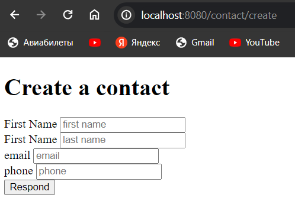

# Приложение для списка контактов

## Как начать работать с приложением

* Для начало работы вам необходима JDK 17 или выше и Docker установленные на вашем компьютере;
* Клонировать репозиторий с gitHub.
```shell
git clone https://github.com/SaprunovEV/list-of-contacts.git
```
* перейти в папку проекта
```shell
cd list-of-contacts
```

## Как запустить тесты
```shell
./gradlew test
```

## Как установить приложение
### Java
```shell
./gradlew build
```

## Как запустить приложение
```shell
docker compose -f docker/docker-compose.yml up 
java -jar build/libs/list-of-contacts-0.0.1-SNAPSHOT.jar
```

## Как пользоваться приложением

### Начальная страница
Данная страница находится по url "/". На ней присутствуют: приветствие и ссылка на [список контактов](#ContactsList).

### <a id="ContactsList">Страница списка контактов</a>
Данная страница доступна по адресу "/contacts". Па ней присутствуют: заголовок таблицы контактов, список всех контактов, после каждого контакта идут ссылки на [редактирование](#editContact) и [удаление](#deleteContact) соответствующего контакта, после списка контактов идёт ссылка на форму [создания нового контакта](#createContact).

### <a id="createContact">Форма создания нового контакта</a>
Данная страница доступна по адресу "/contact/create/".
На ней присутствуют поля для заполнения: имени, фамилии, почты и телефона для нового контакта. В конце есть кнопка отправки данных на сервер, при её нажатии браузер отправит на [страницу контактов](#ContactsList).

### <a id="editContact">Страница редактирования контакта</a>
Данная страница доступна по адресу "/contact/edit/{id}}". На ней присутствуют поля для заполнения (данные поля имеют значения предыдущего контакта): имени, фамилии, почты и телефона для нового контакта. В конце есть кнопка отправки данных на сервер, при её нажатии браузер отправит на [страницу контактов](#ContactsList). 

### <a id="deleteContact">Удаление контакта</a>
По данной ссылке вы удалите соответствующий контакт. После удаления вы переместитесь на [страницу списка контактов](#contactsList).

### По завершению работы
При использовании в тестовом режиме не забудьте удалить контейнер.
Вывести все контейнеры:
```shell
docker container ls -a
```
Удалить контейнер
```shell
docker re {id_container}
```
